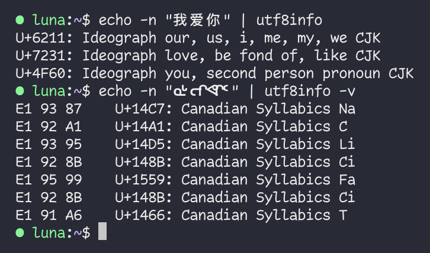

# utf8info


**utf8info** is a small utility that reads a UTF-8 stream and prints out the raw codepoint information. It's useful for spotting invisible control characters like U+202E RIGHT-TO-LEFT OVERRIDE, and interrogating complex Zero-Width-Joiner sequences like 👨‍👩‍👧‍👦, which is composed of 7 characters!

This tool supports codepoints from the latest published version of the Unicode Standard, sourcing data from the [Unicode Character Database](https://unicode.org/ucd/).



## Building & Installing

On macOS and Linux, it _should_ be as simple as running the following inside the `utf8info` directory:

```
make && make install
```

When a new version of the standard is released, you can fetch the latest UCD with `make update`, and then build as before.

Windows is not _officially_ supported, but it'll likely work under WSL.

_Note: Building **utf8info** depends on `curl`, `unzip`, and a C++17-compatible C++ compiler being present._

## Options:

```
-v, --verbose       Enable verbose output. This prints the raw UTF-8 bytes next to the codepoint info.
-d, --definitions   Display definitions for CJK Unified Ideographs
-a, --all           List all known codepoints and exit.
```
